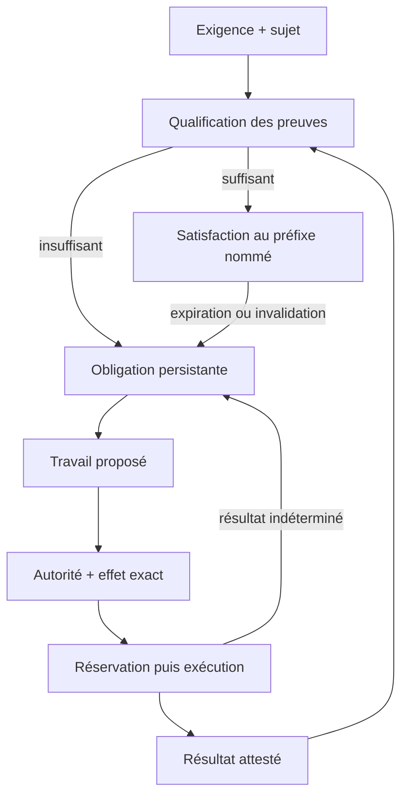

# Stabiliser le cœur de Standard

Proposition d'architecture issue des 18 constats de la revue V7/M2.
Base examinée : `9b1fe507f718ef49c624f940c2d1f14ca08809d4`.
Statut : **contrats proposés, non implémentés**. Ce document ne clôt aucun constat.
Il ne change ni la release, ni la loi, ni les journaux existants.

## Décision centrale

Le cœur gouverne des relations vérifiables entre **exigence, sujet, preuve,
obligation, autorité et effet**. Les intégrations produisent des objets qui
satisfont ces contrats ; elles ne redéfinissent pas leur signification.

Les 18 constats montrent surtout des pertes d'information entre ces objets :
une entrée signée devient une modification seulement possible ; un temps actuel
devient une date acceptable ; un rapport devient un statut ; une réservation
locale devient une promesse de durabilité distante ; une route devient une
promesse de réparation. Ajouter des contrôles isolés laisserait ces conversions
implicites en place.

La stabilité recherchée est celle des contrats et de leurs invariants. Elle ne
suppose ni un état toujours sain, ni la disponibilité permanente des témoins,
ni la réussite des réparations. Une panne doit produire un état interprétable,
une obligation persistante et une reprise autorisée.

## Ce qui doit rester

- Loi effective composée des floors et du client ; aucun affaiblissement des floors.
- Quorum, délai attesté, activation explicite, veto et dépassement gouverné.
- Chaînes de capacités atténuées, provenance et indépendance des détenteurs.
- Entrées signées, historique append-only, genèse extérieurement sélectionnée.
- Réservation avant départ, recontrôle au départ, comparaison des effets exacts.
- Arrêt persistant sur désaccord ; aucune permission issue de la redevabilité.
- Échéance stable d'un écart continu ; retrait gouverné distinct d'une réparation.
- Langage de loi fini et borné ; règles métier extensibles par déclarations.

Ces mécanismes sont déjà largement présents. La refonte doit corriger leur
composition et leurs frontières, sans recommencer leur conception à zéro.

## Six causes, cinq contrats, une boucle

| Cause | Perte de sens actuelle | Contrat qui porte la correction |
|---|---|---|
| Transition incomplète | Modification permise confondue avec modification exigée | Transition |
| Temps implicite | Date d'entrée confondue avec horizon actuel d'action | Temps |
| Preuve aplatie | Statut confondu avec preuve d'un sujet sous une méthode | Preuve |
| Effet incomplet | Nom d'opération confondu avec destination et conséquence exactes | Effet |
| Frontière physique implicite | Vérification logique confondue avec contrôle des credentials et de la persistance | Effet + déploiement |
| Travail fragmenté | Automate d'effet, écarts et plans séparés confondus avec un cycle complet | Obligation |

La frontière physique n'est pas un sixième langage métier. C'est la condition
d'exécution des contrats : si elle n'est pas établie, le système peut encore
produire des propositions, mais ne revendique pas le contrôle des effets.

La flèche du résultat vers la qualification est essentielle : un effet réussi
ne satisfait pas automatiquement l'exigence qui a motivé le travail.

## 1. Contrat de transition

Une transition lie une entrée signée, un préfixe, la loi en vigueur et un résultat
d'état exact. Sa spécification décrit quatre éléments :

| Élément | Sens |
|---|---|
| Préconditions | Identités, signatures, polarité, sujet existant, autorité, temps, état antérieur |
| Delta obligatoire | Modifications requises, avec leur nombre, leur clé et leur valeur |
| Delta interdit | Toute autre modification, y compris un doublon ou un écrasement non prévu |
| Conséquences | Obligations ouvertes/consommées et état de la ligne d'effet |

Le contrat est déclaratif et épinglé par release. Le noyau calcule le delta ;
le second juge vérifie indépendamment que le delta satisfait **tout** le contrat.
Une liste de catégories autorisées n'est qu'un contrôle supplémentaire.

Exemple `freeze` : pour une entrée signée `id=F`, `scope=S`, le delta métier est
exactement `frozen[S] = F`, accompagné de l'enregistrement historique obligatoire.
Un delta vide, un autre scope, une autre valeur ou deux écritures échoue.
Le dégel nomme l'occurrence F ; un gel ultérieur de S invalide ce dégel proposé.
La suppression de proposition lors d'une activation est également obligatoire.

L'admission applique les déclarations OBL de la loi en plus du contrat de base.
Leur delta a sa propre vérification exhaustive ; ce complément ne permet pas
de modifier des tables d'autorité sous couvert d'une obligation.

**Indépendance conservée :** partager des constantes et une spécification ne
signifie pas partager le calcul qui décide. Le second juge ne doit pas appeler
le noyau, son évaluateur de politique ou ses champs compilés pour obtenir son
verdict. Une faute dans la spécification, le parsing canonique, les primitives
cryptographiques ou le runtime reste une dépendance commune à déclarer.

Une matrice de couverture distingue, pour chaque règle critique, calculs
indépendants, dépendances communes et règle à juge unique. Le profil prudent,
les flags, les expirations et la destination physique y figurent explicitement.
La promesse de tolérance à une faute se limite à cette matrice vérifiée.

## 2. Contrat de temps

Trois temps ont des usages différents :

| Temps | Origine | Usage autorisé |
|---|---|---|
| `statement_at` | Entrée signée admise | Ordre historique et relecture déterministe |
| `anchor_at` | Quorum de témoins sur un préfixe exact | Délai gouverné et borne temporelle d'admission |
| `evaluated_at` | Horloge de la frontière d'exécution ou d'évaluation | Expiration actuelle des droits et des preuves |

L'horloge d'exécution est une dépendance de confiance explicite : source,
précision admise, protection contre recul, domaine de panne. Une valeur fournie
par un agent ne suffit pas. Les témoins établissent un temps attesté, pas la
vérité d'une horloge arbitraire partagée avec tous les rôles.

Pour une action, l'exécuteur vérifie à l'horizon actuel les capacités, preuves,
restrictions, profils et fenêtre de départ. Il vérifie séparément que la nouvelle
entrée peut être admise sous l'ancre. Il ne remplace jamais l'heure actuelle par
`min(now, anchor + allowance)` pour obtenir une admission.

Si le temps actuel est hors de l'horizon attesté, aucun départ n'est autorisé.
La projection ouvre `renew-time`, adressée aux témoins ; elle conserve son
ouverture et son échéance tant que l'écart continue. Un checkpoint admis au
préfixe courant permet une nouvelle évaluation, sans renouveler les grants.

Un humain signe uniquement sa revue ou son attestation avec sa propre clé. Il
utilise l'ancre admise ; si elle manque, sa demande attend le renouvellement.
Il ne reçoit pas les clés des témoins. Un checkpoint préparé sur une tête dépassée
est refusé et redemandé sur la tête actuelle.

Le résultat d'un appel peut revenir après la fenêtre d'admission. L'exécuteur
conserve alors le reçu dans un stockage durable lié à la réservation, sans le
transformer en clôture canonique. Après renouvellement, une entrée distingue
le temps du départ, celui du reçu et celui de l'admission. Avant cette admission,
la réservation reste à réconcilier et n'est jamais réémise par simple timeout.

**Propriété de séparation :** avancer l'horizon d'évaluation peut expirer une
autorité ou ouvrir un écart ; cela ne change pas le préfixe et ne crée aucun droit.

## 3. Contrat de preuve

Une preuve est une affirmation limitée, structurée et attribuée. Le niveau
`real` décrit aujourd'hui un rang ; il ne remplace ni le sujet, ni la couverture,
ni le contenu de l'affirmation.

| Champ logique | Contrat minimal |
|---|---|
| Sujet | Identifiant exact du dépôt/asset ; snapshot immuable et digest des entrées pertinentes |
| Exigence | Identifiant et digest du contrat applicable, dans la loi nommée |
| Affirmation | Propriété précise, résultat et limites de ce que ce résultat signifie |
| Méthode | Identité/version de l'outil, configuration, définition protégée des checks |
| Couverture | Univers déclaré, éléments couverts, exclusions et raisons ; identités ou empreintes vérifiables |
| Rapport | Digest d'un rapport conservé et accessible, findings utiles à la réparation |
| Validité | Temps de collecte, expiration et événements invalidants définis par l'exigence |
| Provenance | Identité, chaîne de détenteurs, signatures et dépendances connues |

L'univers à couvrir est défini indépendamment du filtre du scanner. Pour les
secrets, exclure un fichier NUL ou trop grand ne le retire pas silencieusement
de cet univers. Une exclusion explicitement autorisée par l'exigence est
différente d'une incapacité de la méthode : cette dernière ouvre `restore-coverage`.

Pour les dépendances, l'affirmation distingue déclarations directes, lock résolu,
fermeture transitive et environnement ciblé. Un fichier de pins ne prouve pas
la fermeture. Les licences se rapportent aux versions/artefacts exacts ; leur
expression est interprétée selon une politique épinglée. Une sous-chaîne `MIT`
dans une expression complexe n'est pas cette interprétation.

Pour la CI, le sujet nomme tête et base testées, configuration des checks,
workflow, événement et tentative. Le contrat définit comment sélectionner la
tentative pertinente et prouver que l'ensemble consulté est suffisant. Une
tentative plus récente en attente ne laisse pas une ancienne réussite devenir
implicitement la preuve actuelle. Tester la tête seule ne prouve pas le résultat
sur une base qui a changé.

Le collecteur fige un snapshot unique avant les mesures. Un checkout modifié
ou un ensemble de sondes portant sur des commits différents ne produit pas une
preuve commune du dépôt. Une preuve historique reste affichable avec son sujet.

Les résultats volumineux sont conservés hors du journal sous adresse de contenu.
Le cœur vérifie des métadonnées bornées et leur liaison au rapport ; il ne déduit
pas la vérité du rapport de son hash. La confiance dans la méthode et sa source
reste explicite. Une disparition du rapport exigé invalide sa qualification.

La qualification est une relation :

`qualifies(proof, requirement_contract, exact_subject, evaluated_at, actor_label)`.

Elle vérifie contrat, sujet, fraîcheur, niveau, couverture et indépendance.
La qualification qui débloque une action ou consomme une obligation de sûreté
appartient au périmètre de sûreté. Une projection de santé peut la présenter,
mais ne peut pas attribuer de nouveaux droits.

Deux clôtures restent distinctes : la preuve d'application résout l'incertitude
de la réservation ; une preuve qualifiée de l'état résultant résout l'écart
de l'exigence. Par exemple, une PR fusionnée peut satisfaire la première et
laisser la vulnérabilité présente. La seconde obligation reste alors ouverte
avec son échéance initiale.

La conformité ajoute une relation contrôlée entre preuves et clauses. Une
attestation « procédure à jour » peut prouver l'existence d'une procédure ; elle
ne prouve pas une notification d'incident effectuée dans un délai. Les sorties
distinguent `satisfied`, `missing`, `partial`, `not_applicable` gouverné et `fault`.
Une clause satisfaite sous ce modèle n'est pas une certification réglementaire.

## 4. Contrat d'effet et frontière physique

L'effet proposé désigne une conséquence exacte, indépendante du fournisseur.

| Élément | Contenu requis |
|---|---|
| Destination | Fournisseur, compte/tenant, dépôt/ressource, opération et paramètres exacts |
| Sujet et préconditions | Snapshot source, base, diff, checks, politique de scope et invalidations |
| Autorité | Capacité, contrat d'opération, profil humain et restrictions actuelles |
| Sortie de données | Destinataire, classes de données, périmètre et digest du contenu autorisé |
| Reprise | Clé de réservation, support de déduplication, méthode de réconciliation et preuves recevables |

Créer un commit, une branche ou une PR est un effet. Envoyer du contexte à un
modèle externe est un effet de sortie de données. La fusion n'est pas la seule
frontière à gouverner. Plusieurs requêtes fournisseur pour une proposition
forment des étapes identifiées ; une reprise ne les recommence pas en bloc.

Un scope autonome de dépendances porte sur la transformation sémantique
autorisée : packages, versions, sources, hashes et fermeture ciblée. La liste
des chemins est un premier filtre. Modifier un backend de build ou des checks
dans un chemin autorisé demande une autre autorité. Le résultat du modèle reste
une proposition ; ses restrictions locales ne contrôlent pas un agent compromis.

Pour une réparation de secret, le modèle reçoit un contexte explicitement
autorisé et expurgé. Si la classification/expurgation requise échoue, la sortie
de données est refusée et le travail est routé vers une méthode locale ou un
humain. La découverte d'un secret n'accorde jamais le droit de l'envoyer.

### Exécuteur minimal

Les agents et planificateurs ne possèdent pas les credentials capables des
effets gouvernés. Un exécuteur distinct les détient et reçoit seulement des
requêtes canoniques. Une séparation par objet Python dans le même processus
n'établit pas cette isolation. Les credentials sont limités par opération et
destination ; une configuration fournisseur laissant une autre voie d'écriture
invalide la revendication de contrôle exclusif.

L'exécuteur démarre par une entrée vérifiée **avant** import ou accès aux secrets,
depuis une installation immuable approuvée extérieurement. Son manifeste couvre
les adaptateurs et tout code capable de contourner le port. La protection des
sources pendant le chargement, l'intégrité du runtime et de l'hôte restent des
hypothèses distinctes d'un manifeste de fichiers.

Le journal d'admission est durable au-delà de la vie d'un job. Les épingles
survivent dans un domaine de restauration indépendant. L'acquittement de la
réservation précède l'accès au départ. Les exports Git sont des copies de lecture
et de sauvegarde, pas l'autorité de reprise. Une épingle en avance arrête et
permet la restauration de la queue exacte ; aucune récupération ne baisse le pin.

Le recontrôle et l'envoi sont ordonnés contre les admissions concurrentes,
avec un seul chemin de départ. Un verrou local ne couvre pas deux exécuteurs
sur des copies différentes. Si l'architecture devient multi-instance, l'exclusion
et le fencing font partie du contrat de stockage/exécution à démontrer ; aucune
garantie de consensus multi-hôte n'est acquise par cette proposition.

### Limites fournisseur

Si le fournisseur ne peut pas appliquer atomiquement la destination, la base
et les préconditions exactes, une succession GET puis PUT ne suffit pas.
L'adaptateur doit employer une primitive adéquate, ou déclarer l'opération
inexécutable sous ce contrat. Ajouter une seconde lecture ne ferme pas la course.

Pour GitHub, le contrat de fusion doit d'abord décider si la base exacte est
requise, quels commits/checks autorisent le résultat et quelle primitive garantit
ces conditions. Le support effectif est à vérifier avant activation de la route.
Un commentaire contenant une clé n'établit pas l'idempotence du fournisseur.

La réconciliation donne trois issues :

| Issue | Preuve exigée | Suite |
|---|---|---|
| `applied` | Conséquence constatée sur la destination et le sujet exacts | Vérifier la satisfaction de l'exigence |
| `not_applied` | Absence définitive de l'effet de cette réservation, aucune demande encore susceptible d'aboutir | Autoriser l'examen d'une nouvelle tentative |
| `indeterminate` | Information insuffisante, incohérente ou appel encore susceptible d'aboutir | Conserver la réconciliation et bloquer la répétition |

Une PR ouverte n'est pas une preuve d'absence définitive d'une fusion en cours.
Le timeout ferme le droit de départ local ; il ne supprime pas une demande
déjà transmise. `indeterminate` est un résultat de collecte, pas une clôture
dans l'automate canonique. Une intervention humaine ne fabrique pas une preuve
de non-application ; une éventuelle dérogation au risque est un nouveau contrat
gouverné et doit être présentée comme telle.

## 5. Contrat d'obligation et cycle de maintenance

Une obligation désigne le manque à combler. Elle ne constitue ni une permission,
ni un engagement que l'agent saura le combler.

| Élément | Sémantique |
|---|---|
| Identité stable | Exigence/propriété et sujet ou périmètre stable, contrat applicable et génération d'écart |
| Cause | `observe`, `repair`, `restore-coverage`, `renew-time`, `reconcile`, `prove`, `restore-integrity`, `restore-route` |
| Horodatage | Première ouverture et échéance du manque continu, conservées pendant les relances |
| Route | Rôle, opération, adaptateur/méthode, capacité requise et disponibilité constatée |
| Satisfaction | Relation de preuve explicitement requise pour résoudre ce manque |
| Historique | Tentatives, reçus, invalidations, escalades et motif de sortie |

Un changement de commit pendant un écart de même propriété ne repousse pas
son échéance. La preuve doit néanmoins porter sur le nouveau snapshot exact.
Un changement gouverné de contrat conserve la dette continue lorsque le même
manque subsiste ; il ne réutilise pas une ancienne preuve sous le nouveau contrat.
Un retrait d'exigence termine l'applicabilité avec ce motif, jamais « réparé ».

Les cibles sont celles de la loi effective, y compris ajouts et resserrements
client. `ops/`, la maintenance et le dossier lisent la même vue d'obligations et
de preuves qualifiées. Ils peuvent avoir des priorisations différentes, pas
des définitions différentes de ce qui est résolu.

La ligne d'effet est un sous-automate de ce cycle :

| Situation | Travail dérivé | Droit de répéter un effet |
|---|---|---|
| Preuve absente ou périmée | Observer/prover le sujet actuel | Aucun droit supplémentaire |
| Couverture insuffisante | Restaurer univers ou méthode | Aucun droit supplémentaire |
| Intention sans token, délai passé | Abandon logique de la tentative sans départ ; préparer une nouvelle intention sur faits frais | Seulement sous une nouvelle autorisation |
| Token sans réservation, délai passé | Même reprise avant départ | L'ancien token est inutilisable |
| Réservation dans sa fenêtre | Attendre le chemin de départ déjà engagé | Non |
| Réservation expirée ou réponse inconnue | Réconcilier | Non jusqu'à preuve définitive |
| Effet constaté appliqué | Produire une preuve de résultat puis qualifier l'exigence | Pas pour résoudre la même incertitude |
| Non-application définitive | Réobserver puis proposer une nouvelle tentative | Sous nouvelle autorisation |
| Route sans acteur, capacité ou adaptateur opérationnel | Exposer `restore-route` et adresser au propriétaire | Aucun départ de secours implicite |
| Intégrité ou auditeur en panne | Exposer `fault` et restaurer la frontière affectée | Aucun droit issu du rapport |

Les états avant réservation peuvent expirer sans créer une réconciliation :
aucun départ n'est possible sans réservation admise. Ils doivent rester visibles
historiquement, et une projection doit leur donner une suite. Les états après
réservation restent conservateurs. Cette distinction évite aussi bien le blocage
permanent d'un intent périmé que la répétition d'un effet incertain.

Une vue `fault` contient toujours le préfixe connu ou inconnu explicitement,
l'horizon demandé, la frontière en échec et les informations encore fiables.
Elle ne prétend pas disposer des champs d'un audit réussi. Les rapports restent
produits après échec de rôle, via une voie de lecture indépendante. Une panne
du rapport est elle-même observable ; `always()` ne suffit pas si le lecteur
suppose un verdict réussi.

## Traçabilité des 18 constats

Chaque ligne nomme un critère de validation de la future refonte. Aucun n'est
considéré corrigé par la seule adoption de ce texte.

| Constat | Cause dominante | Obligation d'architecture | Scénario d'acceptation |
|---|---|---|---|
| R01 Restriction acquittée sans application | Transition | Delta exact exigé pour chaque restriction et activation | Omission, mauvais sujet, doublon ou mauvais identifiant : désaccord persistant, aucun acquittement |
| R02 Flag/prudence absents du second profil | Transition | Matrice complète des règles de profil, évaluation indépendante au token et au départ | Neutraliser un seul évaluateur n'autorise pas un effet signalé sans humain |
| R03 Temps ops plafonné | Temps | Horizon actuel distinct du temps admis, jamais antidaté | Retarder le guard de 100 jours : zéro départ, demande de temps visible, grants toujours expirés après checkpoint |
| R04 Lancement ops non vérifié | Frontière physique | Une seule entrée vérifiée avant import/secrets, installation protégée | Bytecode forgé ou source modifiée : refus avant accès au credential |
| R05 Ancienne CI verte | Preuve | Sujet, définition et sélection complète de la tentative pertinente | Ancien succès + tentative récente en attente : preuve insuffisante |
| R06 Scope dépendances trop large | Effet | Politique sémantique du diff épinglée | Modifier backend/checks dans `pyproject.toml` ne relève pas de la capacité autonome de versions |
| R07 Snapshot de scanner absent | Preuve | Sujet immuable partagé entre sondes, preuve historique identifiée | Checkout A + CI B, checkout sale ou tête déplacée : aucune qualification de B |
| R08 État publié après effet | Frontière physique | Réservation et pins durables indépendamment du runner avant départ | Détruire le runner à chaque frontière : réservation retrouvée ou départ impossible, jamais nouvelle tentative aveugle |
| R09 Destination/base de fusion | Effet | Préconditions fournisseur effectivement garanties | Changement de base entre contrôle et envoi : opération empêchée ou route déclarée inexécutable |
| R10 Intention/token périmés bloqués | Obligation | Reprise totale des états avant départ, distincte de la réconciliation | Expirer pending/unredeemed : suite dérivée sur faits frais, aucun ancien token réutilisé |
| R11 Humain dépendant des clés témoins | Temps | Renouvellement comme travail distinct | Revue avec la seule clé humaine sous ancre fraîche ; attente explicite sous ancre périmée |
| R12 Univers secrets filtré | Preuve | Univers indépendant de la méthode, exclusions explicites | Secret dans fichier NUL/grand : finding ou manque de couverture, jamais preuve complète silencieuse |
| R13 Pins pris pour fermeture transitive | Preuve | Affirmation et univers de dépendances résolus | Dépendance transitive/dev absente : couverture insuffisante pour l'exigence correspondante |
| R14 Licence par sous-chaîne | Preuve | Versions exactes et politique d'expressions de licence | Expression composée rejetée ou acceptée selon politique, jamais par présence du mot MIT |
| R15 Secret envoyé au modèle | Effet | Sortie de données gouvernée, contexte autorisé | Secret de test trouvé : aucune transmission de sa valeur au modèle externe |
| R16 FAULT casse le rapport | Obligation | Résultat total d'évaluation et lecture indépendante | Auditeur en panne : rapport fault valide et visible après échec du guard |
| R17 Plans/cibles divergents | Obligation | Vue commune issue de la loi effective | Cible client ajoutée/resserrée : même écart dans maintenance, ops et dossier ; absence de route visible |
| R18 Conformité trop large | Preuve | Relation clause/affirmation limitée et preuve substantielle | Procédure attestée sans reçu de notification : clause de notification non satisfaite |

## Organisation proposée

Ce sont des responsabilités, pas une prescription de nouveaux fichiers.

| Responsabilité | Dans le cœur ou la frontière de sûreté | Hors décision d'autorité |
|---|---|---|
| Admission | Loi, signatures, transition, capacités, restrictions, qualification des faits permis | Préparation des entrées |
| Intégrité | Journal durable, pins externes, reprise exacte, arrêt | Export, sauvegarde, visualisation |
| Exécution | Temps actuel, réservation, recontrôle, credentials, port et adaptateur | Proposition de patch et priorisation |
| Preuves | Schéma borné et qualification utilisée pour accorder/consommer | Collecte, rapports détaillés, outils de mesure ; confiance métier explicitée |
| Redevabilité | Projection isolée des manques, aucun pouvoir d'autoriser | Vues opérateur et plans |
| Maintenance | Aucun credential d'effet ni mutation du cœur | Rôles, méthodes, modèles, préparation et demandes humaines |

Un scanner qui atteste un fait permettant un effet est une dépendance de sûreté
du système, même si son implementation reste hors de la TCB locale. Son coût,
son installation et ses modes de défaillance doivent être inventoriés séparément.
Le confondre avec du code purement consultatif fausserait la revue.

Le contrôle de budget reste celui de `tcb-budget.json` : sûreté 2 942 lignes,
restrictif seul 537, visibilité 500 à la base examinée. Aucun déplacement dans
`ops/` ni compression artificielle ne réduit la confiance. Un changement de
classement/plafond demande une décision explicite motivée par la garantie et
la structure obtenues ; la présente proposition n'en adopte aucun.

## Ordre de réalisation et portes de validation

1. **Sceller la sémantique.** Fixer schémas, identités, invalidations et matrice
   de couverture des cinq contrats. Livrer les scénarios de la table comme
   critères ; lever les ambiguïtés de temps, base et non-application avant code.
2. **Refondre transition et temps.** Remplacer les contrôles partiels par des
   contrats complets ; distinguer admission historique et départ actuel ;
   conserver les scénarios de quorum, veto, restriction et reprise des pins.
3. **Établir la frontière durable.** Exécuteur distinct, lancement approuvé,
   journal/pins persistants, receipts et reprises après destruction du job.
   Aucun effet réel autonome avant validation de cette porte.
4. **Rendre les preuves qualifiables.** Sujet figé, méthode, couverture, rapport,
   validité ; définir d'abord CI, dépendances, secrets et attestations utilisées
   par les capacités, puis étendre les producteurs.
5. **Unifier le travail.** Toutes les cibles effectives, délais continus, reprises,
   routes exécutables et état fault ; ops, maintenance et conformité deviennent
   des consommateurs de la même vue. Gouverner aussi création de PR et egress.
6. **Valider le système entier.** Injections de faute isolée, changement de loi,
   invalidation de preuve, crashs à chaque frontière et contrats du fournisseur
   réel. Documenter les dépendances communes et les garanties encore conditionnelles.

Les étapes peuvent partager une branche de refonte, mais chaque porte doit
rester examinable. Les tests existants protègent des comportements utiles ;
ils ne suffisent pas à démontrer ces nouveaux contrats. Les tests adversariaux
visent les invariants, pas l'identité de l'implémentation.

Une nouvelle release adopte ces contrats explicitement. Aucune compatibilité
avec l'ancienne genèse n'est supposée. Une éventuelle importation d'historique
le conserve comme provenance ; elle ne convertit pas les anciennes observations
en nouvelles preuves qualifiées et ne supprime aucune incertitude distante.

## Points à trancher avant la refonte

| Décision | Proposition de départ | Ce qui doit la valider |
|---|---|---|
| Hébergement de l'autorité | Service durable unique pour admission/exécution, export Git en lecture | Modèle de panne, stockage et restauration réellement indépendants des pins |
| Horloge de départ | Horloge de l'exécuteur protégée contre recul, confrontée à l'ancre | Source, précision, redémarrage et comportement en divergence |
| Fusion GitHub | Contrat exact de destination/base/checks ; route inactive si primitive insuffisante | Vérification de la primitive fournisseur et des protections effectives du dépôt |
| Non-application définitive | Preuve par opération/réservation, aucun raisonnement par simple absence | Capacité fournisseur d'identifier ou de terminer une demande encore en cours |
| Rapports de preuve | Stockage par contenu, accès durable et métadonnées bornées | Disponibilité, intégrité, rétention et coût de validation |
| Autonomie de dépendances | Transformations sémantiques étroites par écosystème | Lock résolu, environnement, politique de source et validation du diff |

Une décision ouverte produit une route inactive ou un écart explicite. Elle ne
se transforme pas en hypothèse silencieuse pour permettre un départ.

## État de cette livraison

Cette proposition corrige le **modèle attendu**. Elle fournit une correspondance
complète avec les 18 constats et des critères de réfutation. Le comportement
du commit examiné reste inchangé ; ses constats restent ouverts. Le prochain
travail d'implémentation doit s'évaluer contre ces contrats, et non contre le
nombre de constats marqués comme patchés.

### Ancrage dans les sources examinées

| Constats | Sources de la base examinée |
|---|---|
| R01–R02 | `tcb/kernel.py` (`_freeze`, `_revoke`, `_flag`, `_heartbeat`, `_profile`) ; `tcb/invariants.py` (`check`, `HANDLERS`, `_profile`, `dispatch`) |
| R03–R04, R11 | `ops/node.py` (`now`, `checkpoint`) ; `ops/cycle.py` (`cmd_guard`, `cmd_review`, `cmd_attest`) ; `tcb/guard.py` ; `bootstrap.py` ; `demo/.github/workflows/standard.yml` |
| R05–R07 | `ops/world.py` (`ci`) ; `ops/cycle.py` (`subject_facts`, `cmd_scan`) ; `ops/probes.py` ; `tcb/floors.py` (conditions de réparation) |
| R08–R10 | `ops/state.sh` ; workflow M2 ; `adapters/github.py` ; `ops/lifecycle.py` (`plan`, `NEXT`) ; `tcb/floor0.py` (`LINE`, `line_state`) |
| R12–R15 | `ops/probes.py` (`text_files`, `secrets`, `lock`, `vulns`, `licenses`) ; `ops/agent.py` (`context`, `craft`) |
| R16–R18 | `tcb/health.py` (`Auditor.health`) ; `ops/cycle.py` (`cmd_report`, cibles et sélection du travail) ; `maintenance/planner.py` ; `compliance/dossier.py` ; `compliance/catalog.json` |

Les références fournisseur présentes dans la revue décrivent les API ; aucune
garantie nouvelle de leur comportement n'est supposée ici. La validation réelle
de la primitive de fusion et de réconciliation est une porte encore ouverte.
